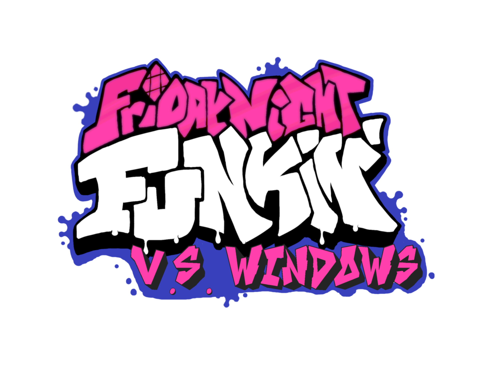

# Friday Night Funkin': V.S. Windows
## Friday Night Funkin'
**Friday Night Funkin'** is a rhythm game originally made for Ludum Dare 47 "Stuck In a Loop".

Links: **[itch.io page](https://ninja-muffin24.itch.io/funkin) ⋅ [Newgrounds](https://www.newgrounds.com/portal/view/770371) ⋅ [source code on GitHub](https://github.com/ninjamuffin99/Funkin)**
> Uh oh! Your tryin to kiss ur hot girlfriend, but her MEAN and EVIL dad is trying to KILL you! He's an ex-rockstar, the only way to get to his heart? The power of music... 

## Kade Engine
V.S. Windows uses Kade Engine for Friday Night Funkin', including a full engine rework, replays, and more.
**REMEMBER**: This is a **mod**. This is not the vanilla game and should be treated as a **modification**. This is not and probably will never be official, so don't get confused.

## Website ([KadeDev.github.io/kade-engine/](https://KadeDev.github.io/Kade-Engine/))
If you're looking for documentation, changelogs, or guides about the engine, you can find those on the Kade Engine website.

# Previews ([skip](#features))

 

# Features

 - **New Input System**
	 - An improved input system, similar to Quaver or Etterna, with less delays, less dropped inputs and other improvements.
 - **More information during gameplay**
	 - While you're playing, we show you information about how you're doing, such as your accuracy, combo break count, notes per second, and your grade/rating.
 - **Customizable keybinds**
	 - Instead of being forced to use WASD and the arrow keys, you can customize the keybinds to any keys you want!
 - **Replays** (in beta)
	 - Have you ever gotten a crazy score but didn't record? The replay system solves that: it automatically saves a "replay" of your gameplay every time you complete a song, which you can play back inside of the game. 
	 - Replays just store information about what you're doing, they don't actually record the screen -- so they take up way less space on your disk than videos.
 - **Audio offset**
	 - If your headphones are delayed, you can set an offset in the options menu to line the game up with the delay and play with synced audio like intended.

# V.S. Windows exlusive features

- **Added Test to the Freeplay Menu**
   - Now you can play the hidden test track very easily, even with more detail.
- **Anti-Piracy Screen**
   - To protect against websites like KBH Games and so on. 
   - It only let's desktop through, so if you want to port this mod, you have to get my permission.
- **Easter eggs**
   - I added some unused stuff, you might easily find it.
- **Week 🪟**
   - Yeah, I think that's obvious...

# Credits
### Friday Night Funkin'
 - [ninjamuffin99](https://twitter.com/ninja_muffin99) - Programming
 - [PhantomArcade3K](https://twitter.com/phantomarcade3k) and [Evilsk8r](https://twitter.com/evilsk8r) - Art
 - [Kawai Sprite](https://twitter.com/kawaisprite) - Music

This game was made with love to Newgrounds and its community. Extra love to Tom Fulp.
### Kade Engine
- [KadeDeveloper](https://twitter.com/KadeDeveloper) - Maintainer and lead programmer
- [The contributors](https://github.com/KadeDev/Kade-Engine/graphs/contributors)

### V.S. Windows
- [POCOGuy or Mohammad Obeid](https://www.youtube.com/watch?v=Hz8Ydipu-7o) - Artist, Programmmer
- [Robbi985 aka. SomethingUnreal](https://www.youtube.com/watch?v=dsU3B0W3TMs) - Made the song "Welcome" (not original name)
- [Ranivius](https://www.youtube.com/channel/UC54OwOh8k1z6ODPwu4-n67A) - Made the song "Executable" and "Windows Update" (not original name)

### Shoutouts
- [GWebDev](https://github.com/GrowtopiaFli) - Video Code
- [Rozebud](https://github.com/ThatRozebudDude) - Ideas (that I stole)
- [Puyo](https://github.com/daniel11420) - Setting up appveyor and a lot of other help
- [Nickessss (Nickesss cuz yt doesn't accept it somehow)](https://www.youtube.com/channel/UCpRUDzVbQCiyn_YRSvLA30g) - For da homie👍
- My community - For helping me to get this mod popular.
